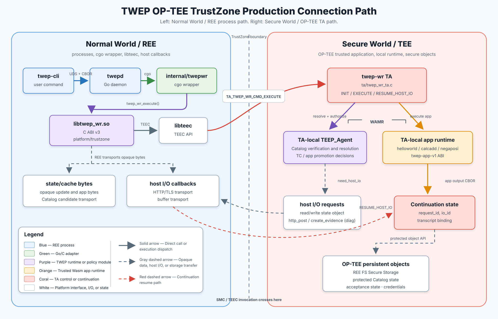

# twep

`twep` (Trusted Wasm Execution Platform) runs Trusted Wasm Apps from
`twep-cli` through `twepd`, the `twep-wr` C ABI boundary, WAMR, and Rust
`no_std` Wasm applications.

The Go module and intended public repository path are
`github.com/s-miyazawa/twep-system`. The project is licensed under the
BSD-2-Clause license.

The current vertical slice provides:

```sh
twep-cli helloworld
twep-cli calcadd 3 4 5
twep-cli negaposi -i testdata/images/medium.jpg -o /tmp/twep-output.jpg
```

The platform has two primary backends:

- The plain Linux backend runs WAMR in the REE process and provides a direct
  development, integration, and test environment.
- The TrustZone (OP-TEE) backend preserves the same public C ABI while running
  the TEEP Agent, Catalog resolution, and Trusted Wasm Apps in TA-local WAMR.

Both backends use the same `no_std` Wasm binaries and the same CBOR application
ABI. Platform-specific behavior is implemented behind the `twep-wr` boundary.

The following diagram shows the TrustZone (OP-TEE) backend, including the
relationships between REE commands and daemon components, the TEE-side TA and
TEEP Agent, and OP-TEE secure storage:



## Security status

The repository includes mock and explicitly insecure AttesTAM demonstration
modes alongside work toward a verified TEEP/COSE/SUIT path. Do not interpret a
successful demo as a production security claim. In particular,
`attestam-insecure` uses development credentials. The TrustZone
`attestam-verified` academic path can protect a Catalog and one requested app,
authorize the app digest, and execute it inside the TA, but still retains
`final-verified=false` because the Evidence and credentials are fixed
development fixtures rather than a production trust chain.

The private keys embedded in `internal/demokeys`, `internal/teepbroker`, and
the TEEP Agent sources are intentionally insecure, public, demo-only fixtures.
They exist solely to make disposable demonstrations and automated tests
reproducible. Never use them in production, shared validation environments,
long-lived deployments, or with external services. Provision fresh,
deployment-specific credentials for any real deployment.

## Prerequisites

- Go 1.22 or later
- Rust toolchain with the `wasm32-unknown-unknown` target
- CMake and a C compiler
- OpenSSL development files
- A WAMR checkout

The default WAMR location is `${HOME}/opt/wasm-micro-runtime`. Override it when
needed:

```sh
make WAMR_DIR=/path/to/wasm-micro-runtime build
```

## Build and test

```sh
make fmt
make build
make test
make e2e
make e2e-attestam-insecure
```

`make build` compiles the Go commands, C shared library, and Rust Wasm
components. The resulting Wasm files are signed with the insecure demo-only
code-signing keys described above. `make e2e` creates a temporary state
directory, installs the local Catalog and applications through the mock
resolver, and exercises all three commands.

The AttesTAM fixture E2E test uses the actual daemon and CLI with a local
fixture HTTP server; it does not require external AttesTAM or Veraison
services. For live service setup, fixture registration, environment variables,
and validation commands, see [docs/AttesTAM.md](docs/AttesTAM.md).

The TrustZone backend has a separate OP-TEE build and QEMU smoke suite. See
[docs/Testing.md](docs/Testing.md) and
[optee/twep-wr-ta/README.md](optee/twep-wr-ta/README.md) for the required
OP-TEE environment, `make build-optee-trustzone`, and the TrustZone smoke
targets.

For the `riscv-optee` v9 workspace, place `twep-system` and `riscv-optee`
beside one another, build v9 once to provide its RV64 Buildroot SDK, and run:

```sh
make build-optee-riscv-v9
make smoke-optee-riscv-v9
```

The first target cross-builds the normal-world library, `twepd`, `twep-cli`,
the diagnostic client, and the WAMR-enabled TA, then installs them into the v9
Buildroot image. The smoke target boots that image under QEMU and checks
TA-local WAMR, deterministic instruction metering, public C ABI v3, the full
daemon/CLI path, and kernel health. The Wasm application artifacts remain the
same platform-independent binaries used by the Linux and ARM OP-TEE builds.

## Manual run

Start `twepd` in one terminal:

```sh
state="$(mktemp -d)"
sock="$state/twepd.sock"
./bin/twepd --socket "$sock" --state-dir "$state"
```

Then run:

```sh
./bin/twep-cli --socket "$sock" helloworld
./bin/twep-cli --socket "$sock" calcadd 3 4 5
./bin/twep-cli --socket "$sock" negaposi \
  -i testdata/images/medium.jpg -o "$state/output.jpg"
```

Expected output:

```text
Hello, World!!
12
Saving a Reversed Color Image
```

## Design summary

- `catalog.cbor` is the authoritative Catalog File format. Debug JSON is never
  a trust authority.
- In verified mode, only a separately verified `twep-catalog-v1` Catalog
  Trusted Component may update the Catalog File. An application TC,
  personalization data, management API artifact, or debug file may not do so.
- General Trusted Wasm Apps receive their primary input and output through the
  `twep-app-v1` CBOR ABI. Administrative hostcalls are reserved for the signed
  TEEP Agent.
- General Wasm Apps are checked against the Catalog SHA-256 and their embedded
  `twep.sig` signature before execution.
- `negaposi` accepts JPEG input. The host writes returned bytes to the path
  selected by the user; the Wasm application itself receives no file hostcall.
- The plain Linux backend uses WAMR interpreter mode and a user-owned
  Unix-domain socket.
- The TrustZone backend is implemented under `optee/twep-wr-ta`; its smoke
  tests require a suitable OP-TEE/QEMU environment and toolchain.

The primary public documentation is:

- [docs/Status.md](docs/Status.md) — implemented milestone and decision index; read this first for current behavior
- [Spec.md](Spec.md) — overall product specification
- [docs/Architecture.md](docs/Architecture.md) — components and trust boundaries
- [docs/Interface.md](docs/Interface.md) — IPC and host interfaces
- [docs/ABI.md](docs/ABI.md) — authoritative Wasm ABI and CBOR schemas
- [docs/Security.md](docs/Security.md) — threat model and security requirements
- [docs/AttesTAM.md](docs/AttesTAM.md) — public AttesTAM integration guide
- [docs/Testing.md](docs/Testing.md) — test layers and commands
- [docs/References.md](docs/References.md) — external standards and references

The JPEG files in `testdata/images/input.jpg` and
`testdata/images/medium.jpg` are tiny synthetic fixtures generated by the test
fixture script. They contain no third-party image content and are retained for
reproducible tests.

## License and copyright

BSD 2-Clause License

Copyright (c) 2026 SECOM CO., LTD.
All rights reserved.

See [LICENSE](LICENSE) for the complete license text. Third-party dependencies
remain subject to their respective licenses.

## Acknowledgements

This work was supported by JST K Program Grant Number JPMJKP24U4, Japan.

The architecture and design of the Trusted Wasm Execution Platform were developed by the project team. AI-assisted development tools were used to support implementation, documentation, and testing. The project team reviewed and validated the resulting work and remains responsible for its technical content.
