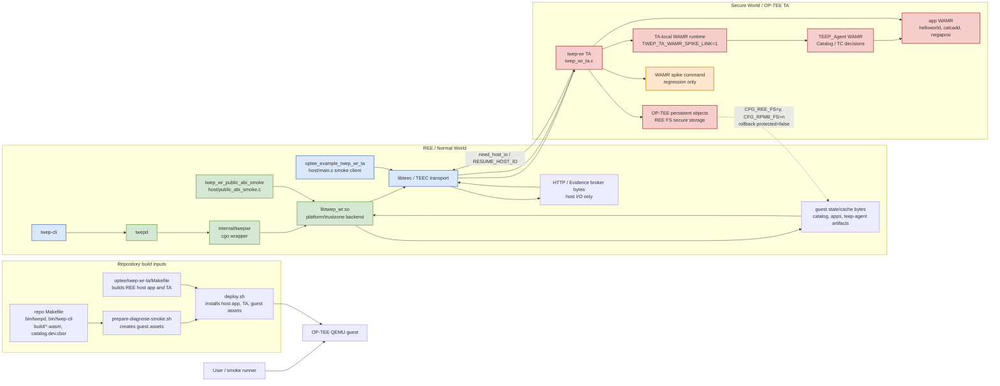
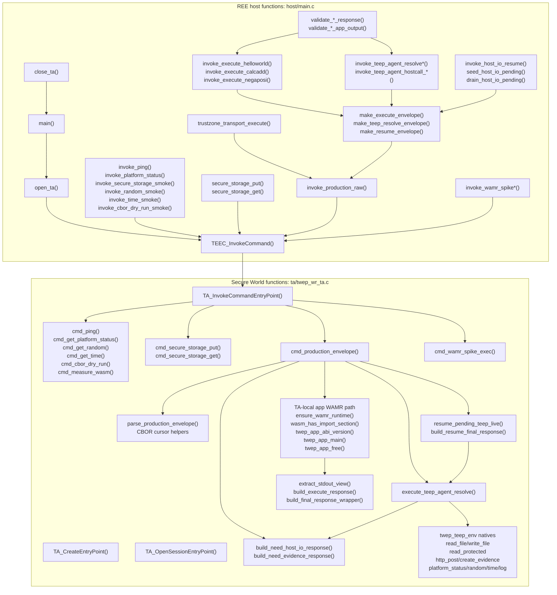

# OP-TEE Software Structure Diagrams

This note maps the `optee/twep-wr-ta/` project at three levels:

- Overview diagram: production public, direct TA smoke, and WAMR spike paths.
- File relationship diagram: source, script, and generated artifact roles.
- Function relationship diagram: direct TA smoke host/TA control flow.

Generated build outputs under `guest/`, `build/`, `host/*.o`, and `ta/*.ta`
are intentionally summarized instead of expanded.

TA-local TEEP_Agent and app Wasm execution require building the TA with
`TWEP_TA_WAMR_SPIKE_LINK=1`. The default `make -C optee/twep-wr-ta` build
leaves those paths unlinked. See `README.md` for the full build-flag table.

For a rendered SVG focused on the production `twepd -> cgo -> libtwep_wr.so
-> libteec -> TA` path, see `docs/optee_trustzone_production.svg`.

## Path Legend

| Path | Diagram meaning |
| --- | --- |
| Production public path | The user-facing TrustZone backend path: `twepd` calls `libtwep_wr.so` through `internal/twepwr`, and `libtwep_wr.so` invokes the TA through `libteec`. |
| Direct TA smoke path | The `optee_example_twep_wr_ta` smoke client calls TA private commands directly through `libteec` to validate boundary behavior quickly. |
| WAMR spike path | The regression-only `TA_TWEP_WR_CMD_WAMR_SPIKE_EXEC` command entrypoint. It shares the `TWEP_TA_WAMR_SPIKE_LINK=1` TA build with production TA WAMR, but is separate from production `twep_wr_execute`. |

## Overview Diagram

## File Relationship Diagram

```mermaid
flowchart TB
    subgraph project["optee/twep-wr-ta/"]
        readme["README.md\nscope, command ABI, smoke list"]
        arch["ARCHITECTURE.md\nthese diagrams"]
        projectconf["project.conf\nAPP_NAME=twep_wr_ta\noptee_postrun metadata"]
        topmake["Makefile\nhost build, TA build, optional WAMR shim"]
        gitignore[".gitignore\nignored generated outputs"]

        subgraph hostdir["host/"]
            hostmake["Makefile\nbuild optee_example_twep_wr_ta"]
            hostmain["main.c\nTEEC smoke and direct TA command client"]
            publicsmoke["public_abi_smoke.c\nbuilt by prepare-diagnose-smoke.sh"]
            hostbin["optee_example_twep_wr_ta\nignored build output"]
        end

        subgraph tadir["ta/"]
            taheader["include/twep_wr_ta.h\nUUID and command IDs 0-11"]
            tac["twep_wr_ta.c\nTA entrypoints, command handlers, WAMR paths"]
            tamake["Makefile / sub.mk / Android.mk\nTA build glue"]
            tabin["*.ta, *.elf, *.map\nignored build outputs"]
        end

        subgraph wamrdir["wamr-ta/"]
            wamrcmake["CMakeLists.txt\nbuild TA-safe iwasm archive"]
            wamrplatform["platform/\nTA memory, time, log shims"]
            wamrbuild["build/wamr-ta/libiwasm.a\noptional generated archive"]
        end

        subgraph scripts["guest and smoke scripts"]
            prepare["prepare-diagnose-smoke.sh\nbuild/copy guest assets"]
            deploy["deploy.sh\ninstall into QEMU guest"]
            runner["run_trustzone_smokes.sh\nmode dispatcher"]
            diagnose["diagnose_verified_trustzone.sh\nverified diagnostics smoke"]
            provision["provision_and_diagnose_trustzone.sh\nprotected object provisioning smoke"]
            failures["protected_storage_failure_smoke.sh\nnegative storage smoke"]
        end

        subgraph generated["ignored generated guest tree"]
            guestbin["guest/bin/\ntwepd, twep-cli, public ABI smoke"]
            guestbuild["guest/build/\nTEEP_Agent, app Wasm, catalog, libtwep_wr.so"]
            guestfixtures["guest/fixtures/\nJPEG and verified-mode CBOR fixtures"]
        end
    end

    topmake --> hostmake
    topmake --> tamake
    topmake --> wamrcmake

    hostmain --> taheader
    publicsmoke --> taheader
    prepare --> publicsmoke
    tac --> taheader
    tamake --> tac
    tamake --> taheader
    wamrcmake --> wamrplatform
    topmake -.->|"TWEP_TA_WAMR_SPIKE_LINK=1\nproduction + spike WAMR"| wamrbuild
    wamrbuild -.->|"linked into TA build"| tamake

    prepare --> guestbin
    prepare --> guestbuild
    prepare --> guestfixtures
    deploy --> hostbin
    deploy --> tabin
    deploy --> guestbin
    deploy --> guestbuild
    deploy --> guestfixtures

    runner --> hostbin
    runner --> guestbin
    runner --> guestbuild
    runner --> guestfixtures
    runner --> diagnose
    runner --> provision
    runner --> failures
    projectconf --> artifacts
```

## Function Relationship Diagram

This diagram focuses on `host/main.c`, the direct TA smoke client. It does not
represent the normal `twepd` public path; use the rendered SVG and the overview
diagram above for that production connection path. Functions inside the
`#ifdef TWEP_TA_WAMR_SPIKE_LINK` block (production TEEP/app WAMR,
`cmd_wamr_spike_exec`, and most TEEP natives) are omitted when the TA is built
with the default `TWEP_TA_WAMR_SPIKE_LINK=0`.

`cmd_measure_wasm()` is invoked from `libtwep_wr.so` `platform/trustzone`, not
from `host/main.c`. `read_protected` maps the protected object allowlist to
OP-TEE REE FS Secure Storage. Generic TEEP_Agent writes to
`teep-agent/verified-evidence-result.cbor` are rejected. The public REE Secure
Storage PUT command also rejects `verified-evidence-result.cbor`, the logical
`teep-acceptance-state.cbor` name, and both TA-internal slot names. The
dedicated D043 acceptance commit is the only path that updates the slots and
persists the positive-result object, which the final-capable reader observes
through the protected path.
